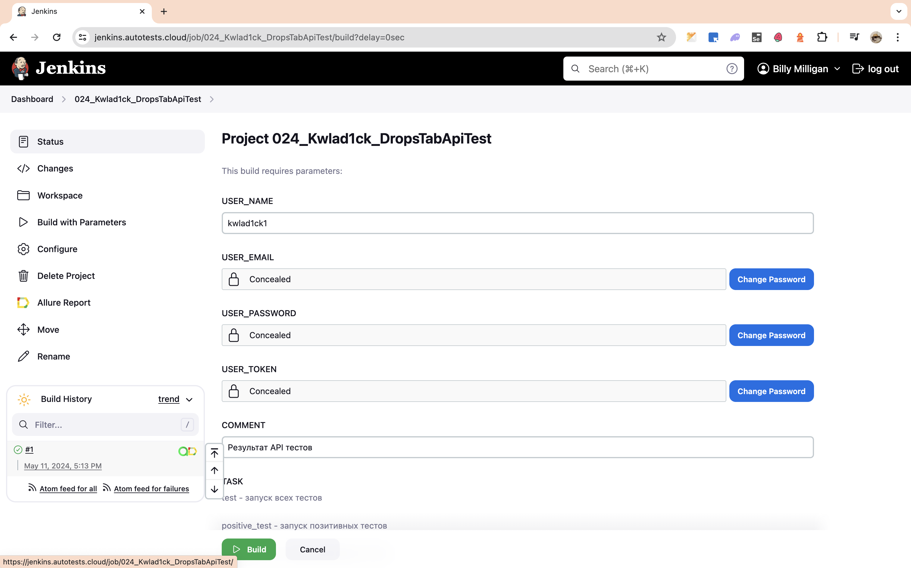
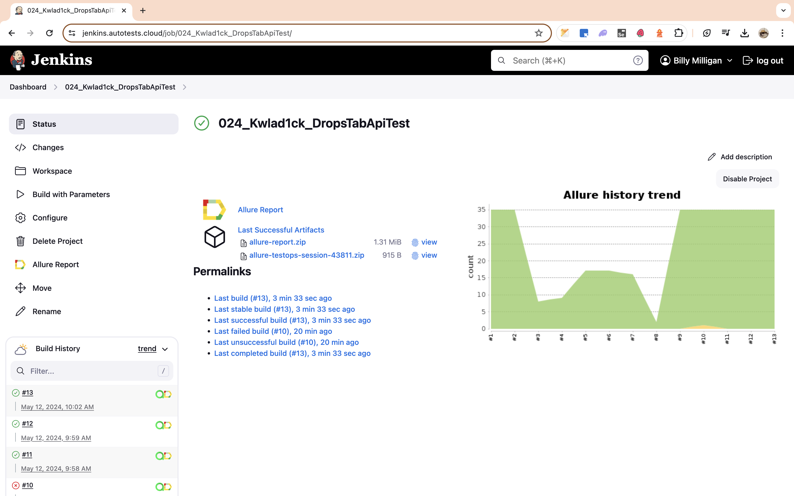

# Проект по автоматизации тестовых сценариев API для сайта [DropsTab.com](https://dropstab.com/)
<p align="center">
<a href="https://dropstab.com/"></a>
</p>

## :pushpin: Содержание:

- [Используемый стек технологий](#computer-используемый-стек-технологий)
- [Особенности проекта](#star-особенности-проекта)
- [Реализованные проверки](#scroll-реализованные-проверки)
- [Запуск автотестов](#arrow_forward-запуск-автотестов)
- [Сборка в Jenkins](#-сборка-в-jenkins)
- [Интеграция с Allure TestOps](#-интеграция-с-allure-testOps)
- [Пример Allure-отчета](#-пример-allure-отчета)
- [Интеграция с Jira](#-интеграция-с-jira)
- [Уведомления в Telegram](#-уведомления-в-telegram-канал-с-использованием-бота)
- [Видео примера запуска тестов в Selenoid](#-видео-пример-запуска-автотестов-в-selenoid)

## :computer: Используемый стек технологий

<p align="center">
<a href="https://www.java.com/"></a>
<a href="https://github.com/"></a> 
<a href="https://www.jetbrains.com/idea/"></a> 
<a href="https://selenide.org/"></a> 
<a href="https://gradle.org/"></a>
<a href="https://junit.org/junit5/"></a>
<a href="https://www.jenkins.io/"></a>
<a href="https://aerokube.com/selenoid/"></a> 
<a href="https://github.com/allure-framework/allure2"></a>
<a href="https://telegram.org/"></a> 
<a href="https://qameta.io/"></a> 
<a href="https://www.atlassian.com/ru/software/jira/"></a>
</p>

- Тесты в проекте написаны на языке : [Java](https://www.java.com/ru/)
- C применением фреймворка для модульного тестирования : [Junit5](https://github.com/junit-team/junit5)
- Система автоматической сборки : [Gradle](https://github.com/gradle)
- Реализация UI тестов с помощью [Selenide](https://selenide.org/), обеспечивающего простой и мощный синтаксис для управления браузером и взаимодействия с веб-элементами
- Удаленный запуск с выбором параметров для тестов реализован при помощи :  [Jenkins](https://www.jenkins.io/)
- Отчеты о пройденных тестах формируются при помощи : [Allure](https://github.com/allure-framework)
- Так же отчеты о тестировании отправляются в мессенджер при помощи [Telegram](https://t.me/publicApiDropsTests) бота
- Реализована интеграция  с [Allure TestOps](https://qameta.io/)
- Реализована интеграция с [Jira Software](https://www.atlassian.com/software/jira)
- Реализация API тестов при помощи [RestAssured](https://rest-assured.io/)

<a id="features"></a>
## :star: Особенности-проекта
- Использование техноголии `Owner` для придания тестам гибкости и легкости конфигурации
- Использование библиотеки `JavaFaker` для генерации рандомных и выборки тестовых данных
- Использование подхода `Lombok` для моделей в API тестах

По итогу прохождения тестов генерируется `Allure-отчет`, который содержит в себе 
* Результат выполненных тестов;
* Видимость шагов при выполение тестов;
* Отправленный запрос каждого теста в форме `Url`, `Body`, `Headers`, `Curl`;
* Полученный ответ для теста в форме `Status code`, `Body`, `Headers`;

## :scroll: Реализованные проверки:
### Авторизация
- [x] Проверка наличия заголовка на главой странице
- [x] Успешная авторизация пользователя
- [x] Проверка негативной авторизации пользователя
- [x] Отправка запроса на регистрацию пользователя
- [x] Отправка запроса на регистраци с невалидным Email
- [x] Отправка запроса на регистраци без пароля
- [x] Отправка запроса регистрации c длинным именем пользователя
- [x] Запрос на регистрацию с уже существующим Email в системе
- [x] Запрос на регистрацию с уже существующим Username в системе
- [x] Отправка письма подтвержденния существующего аккаунта
- [x] Отправка письма подтвержденния на несуществующий Email
- [x] Выслать ссылку восстановления пароля на почту юзеру
- [x] Проверка Username на сущестование
- [x] Проверка Username что он не сущестует
- [x] Запрос возвращения текущего пользователя
- [x] Запрос возвращения неавторизованной учетки
- [x] Не успешная смена пароля акканута

### Раздел потфолио
- [x] Получение списка портфолио аккаунта
- [x] Создание нового портфолио для аккаунта
- [x] Удаление рандомного портфолио аккаунта
- [x] Изменение имени, описания, цвета и включеня/исключения в тотал портфолио
- [x] Измнения типа шеринга портфолио
- [x] Измнения ссылки шеринга портфолио
- [x] Изменение ссылки шеринга портфолио невалидным количеством символов
- [x] Изменение ссылки шеринга портфолио с запретными словами
- [x] Изменение ссылки шеринга портфоило c символами кирилицы
- [x] Изменение внутренних настроек портфолио
- [x] Создание дубликата портфолио
- [x] Проверка запроса на получения списка заметок портфолио
- [x] Создание заметки в портфолио
- [x] Редактирование рандомной заметки в портфолио
- [x] Удаление заметки в портфолио
- [x] Получение цены монеты в рандомное время
- [x] Добавление транзакции в портфолио

## :arrow_forward: Запуск автотестов
> [!NOTE]
> Для локального запуска тестов убедитесь, что у вас установлены Java, Gradle, IntelliJ IDEA
> 
> Подробную инструкцию по установке можно найти по [ссылке](https://github.com/qa-guru/getting-started-java/wiki)

### Локальный запуск тестов из терминала (с параметрами по умолчанию)

```
gradle clean test
```

### Запуск тестов из Jenkins (с указанием параметров)
```
clean ${TASK}
-Duser.name.dt=${USER_NAME}
-Duser.email=${USER_EMAIL}
-Duser.password=${USER_PASSWORD}
-Duser.token=${USER_TOKEN}
```

<p align="center">

</p>

### Параметры сборки
* <code>TASK</code> - Определяющий тег для запуска необходимых тестов.
* <code>USER_NAME</code> – Имя пользователя учетной записи в DropsTab. По умолчанию – <code>kwlad1ck</code>.
* <code>USER_EMAIL</code> – Email пользователя для авторизации в учетной записи.
* <code>USER_PASSWORD</code> – Пароль для авторизации учетной записи в системе DropsTab.
* <code>USER_TOKEN</code> – Токен учетной записи авторизованного пользователя для API тестов.

### Параметры Task 
* <code>test</code> - запуск всех тестов;
* <code>positive_test</code> - запуск коллекции позитивных тестов;
* <code>negative_test</code> - запуск коллекции негативных тестов;
* <code>auth_test</code> - запуск коллекции тестов авторизации/регистрации пользователя;
* <code>portfolio_test</code> - запуск коллекции тестов раздела портфолио;
* <code>transaction_test</code> - запуск коллекции тестов транзакций;

##  [Сборка](https://jenkins.autotests.cloud/job/024_Kwlad1ck_DropsTabApiTest/) в Jenkins

Для запуска сборки необходимо перейти в раздел <code>Build with parameters</code> и нажать кнопку <code>Build</code>.
<p align="center">

</p>

После выполнения сборки, в блоке <code>Build History</code> напротив номера сборки появятся значки <code>Allure TestOps</code> и <code>Allure Report</code>, при клике на которые откроется страница с сформированным html-отчетом и тестовыми артефактами.

##  [Интеграция](https://allure.autotests.cloud/project/4102/dashboards) с Allure TestOps

На *Dashboard* в <code>Allure TestOps</code> видна статистика количества тестов: сколько из них активных/находяться в ревью/черновик/устаревшие, а так же количество ручных и автоматизированных тестов. Результаты выполнения тестов приходят в автоматическом режиме по интеграции при каждом запуске сборки проекта.

<p align="center">

</p>

### Результат выполнения сборки #10

<p align="center">

</p>

##  [Пример](https://jenkins.autotests.cloud/job/024_Kwlad1ck_DromRu/10/allure/) Allure-отчета
### Основаня страница отчета

<p align="center">

</p>

### Результат выполнения автотестов

<p align="center">

</p>

### Графики

<p align="center">

</p>

##  [Интеграция](https://jira.autotests.cloud/browse/HOMEWORK-1149) с Jira

Реализована интеграция <code>Allure TestOps</code> с <code>Jira</code>, в задаче отображаются прикрепленные тесты и результат прогона сборки #10.

<p align="center">

</p>

##  Уведомления в [Telegram канал](https://t.me/publicDromAlerts) с использованием бота 

После завершения сборки и прохождения всех тестовых сценариев в [Telegram канал](https://t.me/publicDromAlerts) приходит оповещение с отчетом о результатах прохождения автотестов.

<p align="center">

</p>

##  Видео пример запуска автотестов в Selenoid

В отчетах Allure для каждого теста прикреплён не только скриншот, но и видео прохождения теста, записанное Selenoid.
<p align="center">
  
</p>